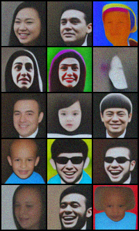

# Diffusion superresolution

Here's another (still in progress) diffusion model for superresolution with attention.
It seems to work, but I'm having trouble implementing the sampling process. Also, the architecture is too big. It should work with much fewer parameters.

The model also works for images generation with a very minor tweak. Here is some training with FFHQ. 

  

They look horrible but its probably due to the sampling procedure (hopefully).
