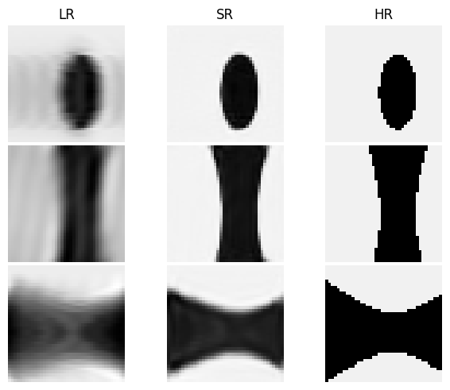
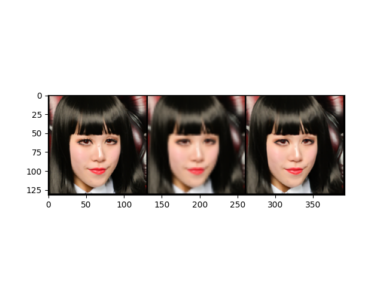

# mri-super-resolution
A deep learning model for performing super-resolution of 2D/3D images adapted from 
*MRI Super-Resolution with GAN and 3D Multi-Level DenseNet: Smaller, Faster, and Better* by Yuhua Chen, Anthony G. Christodoulou, Zhengwei Zhou, Feng Shi, Yibin Xie, Debiao Li.

Here's with a toy 3d dataset

Here's with a faces dataset

